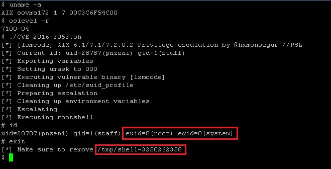

# CVE-2016-3053: AIX lsmcode Local Root Exploit

## Information
**Description:** Allows a locally authenticated user to obtain root level privileges.  
**Versions Affected:** AIX 6.1/7.1/7.2.0.2  
**Researcher:** Hector Monsegur (https://twitter.com/hxmonsegur)  
**Disclosure Link:** https://rhinosecuritylabs.com/research/unix-nostalgia-hunting-zeroday-vulnerabilities-ibm-aix/  
**NIST CVE Link:** https://nvd.nist.gov/vuln/detail/CVE-2016-3053  

## Proof-of-Concept Exploit
### Description
1. Export MALLOCBUCKETS environment variable, specifying the bucket statistics file as /etc/suid_profile
2. Set umask to 000, so that /etc/suid_profile would be writable
3. Execution of lsmcode, in turn creating our arbitrary bucket statistics file
4. Overwrite /etc/suid_profile, removing statistics from interrupting escalation flow
5. Adding arbitrary payload to /etc/suid_profile
6. Execute SUID binary, thus and consequently executing payload inside of /etc/suid_profile
7. Rootshell is saved into /tmp and ready for use

### Usage/Exploitation
`./CVE-2016-3053.sh`  

### Screenshot
