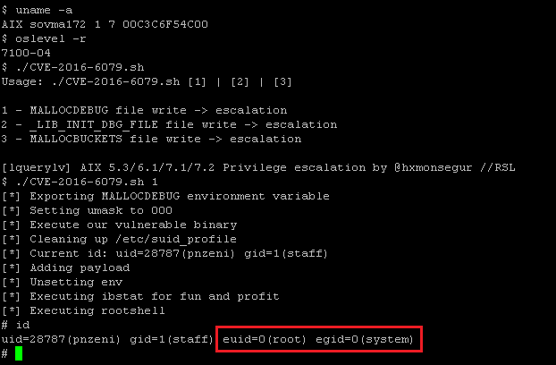

# CVE-2016-6079: AIX lquerylv 5.3, 6.1, 7.1, 7.2 Local Root Exploit

## Information
**Description:** Allows a locally authenticated user to obtain root level privileges.  
**Versions Affected:** AIX 6.1/7.1/7.2.0.2  
**Researcher:** Hector Monsegur (https://twitter.com/hxmonsegur)  
**Disclosure Link:** https://rhinosecuritylabs.com/research/unix-nostalgia-hunting-zeroday-vulnerabilities-ibm-aix/  
**NIST CVE Link:** https://nvd.nist.gov/vuln/detail/CVE-2016-6079  

## Proof-of-Concept Exploit
### Description
This exploit takes advantage of known issues with debugging functions within the AIX linker library. We are taking advantage of known functionality, and focusing on badly coded SUID binaries which do not adhere to proper security checks prior to seteuid/open/writes.  

### Usage/Exploitation
`./CVE-2016-6079.sh`

### Screenshot
