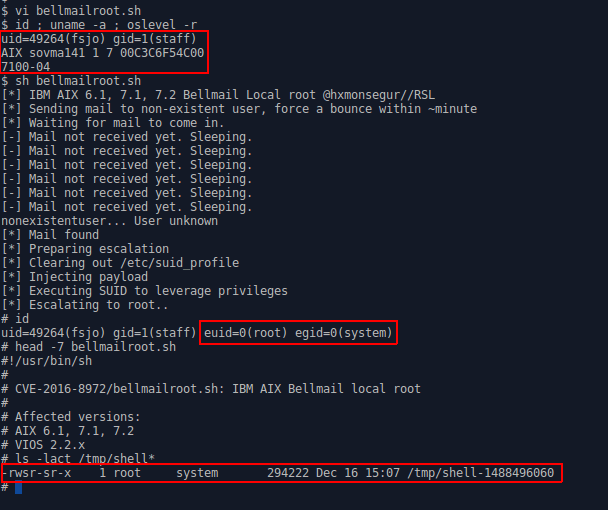

# CVE-2016-8972: IBM AIX Bellmail Local Root Exploit

## Information
**Description:** Allows a locally authenticated user to obtain root level privileges.  
**Versions Affected:** AIX 6.1, 7.1, 7.2 VIOS 2.2.x  
**Researcher:** Hector Monsegur (https://twitter.com/hxmonsegur)  
**Disclosure Link:** https://rhinosecuritylabs.com/research/unix-nostalgia-aix-bug-hunting-part-2-bellmail-privilege-escalation-cve-2016-8972/  
**NIST CVE Link:** https://nvd.nist.gov/vuln/detail/CVE-2016-8972  

## Proof-of-Concept Exploit
### Description
1. Send mail to a non-existent user
2. Within 60 seconds sendmail will bounce the email back
3. Execute Bellmail binary
4. While inside of the bellmail client, execute the following: w /etc/suid_profile (or ’s’)  

### Usage/Exploitation
`./CVE-2016-8972.sh`  

### Screenshot

