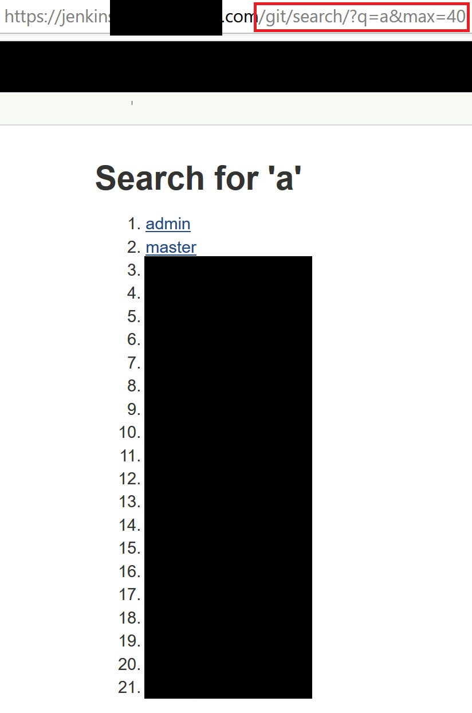
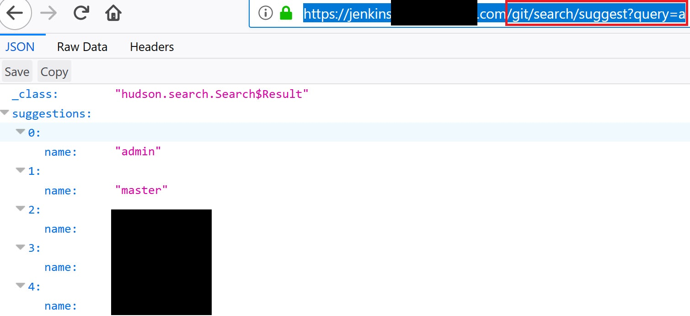

# CVE-2018-1000110: User and Node Enumeration Through Jenkins Git Plugin <v3.7

## Information
**Description:** An improper authorization vulnerability exists in Jenkins Git Plugin version 3.7.0 and earlier in GitStatus.java that allows an attacker with network access to obtain a list of nodes and users.  
**Versions Affected:** Jenkins Git plugin version 3.7.0 and earlier  
**Researcher:** Spencer Gietzen (https://github.com/SpenGietz)  
**Disclosure Link:** https://jenkins.io/security/advisory/2018-02-26/#SECURITY-723  
**NIST CVE Link:** https://nvd.nist.gov/vuln/detail/CVE-2018-1000110  

## Proof-of-Concept Exploit
### Description
A vulnerability in the Jenkins Git plugin allows an unauthenticated user to enumerate a list of nodes and users by using the "Search" functionality, even if access is normally blocked to the "Search" function. As an unauthenticated user, you will likely find a 403 response when trying to search anything through the Jenkins web UI. The search paths that are tried are https://jenkins.thewebsite.com/search/suggest?query=x and https://jenkins.thewebsite.com/search/?q=x, which both will return 403 errors. This can be bypassed by using the Git plugin, which is shown below.  

### Usage/Exploitation
To exploit this vulnerability, include the Git plugin path in your search queries. Examples and their HTTP response codes are listed here:
- https://jenkins.thewebsite.com/search/?q=x returns 403
- https://jenkins.thewebsite.com/search/suggest?query=x returns 403
- https://jenkins.thewebsite.com/git/search/?q=x returns a list of nodes and users with "x" in their names
- https://jenkins.thewebsite.com/git/search/suggest?query=x returns a list of nodes and users with "x" in their names  

There is a max limit on the number of users returned, so it is possible to include the "&max=100" parameter to increase that maximum to 100. Otherwise, it will let you paginate through the users.  
To gather a complete list of users and nodes, just cycle through the alphabet (and possibly numbers) with your search.

### Screenshot

