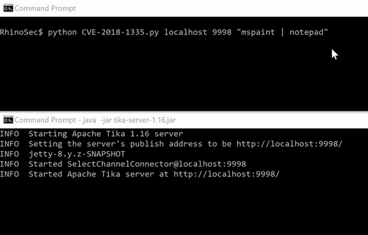

# CVE-2018-1335: Command Injection in Apache Tika-server

## Information
**Description:** This is a PoC for remote command execution in Apache Tika-server.  
**Versions Affected:** Tika-server versions < 1.18   
**Researcher:** David Yesland (https://twitter.com/daveysec @daveysec)  
**Blog Link:** https://rhinosecuritylabs.com/application-security/exploiting-cve-2018-1335-apache-tika/  
**Original Advisory:** http://mail-archives.apache.org/mod_mbox/www-announce/201804.mbox/%3CCAC1dCwVhrPRyFJMS5BbY02%2B495CUODrAzndqZkvKacJnXUSm%2Bw%40mail.gmail.com%3E  
**NIST CVE Link:** https://nvd.nist.gov/vuln/detail/CVE-2018-1335  

## Proof-of-Concept Exploit
### Description
This PoC exploits a command injection vulnerability in Apache Tika-server < 1.18 and uses Cscript.exe to execute Jscript or VBS code and run arbitrary commands.

### Usage/Exploitation
Usage: `python CVE-2018-1335.py HOST PORT COMMAND`  
Example: `python CVE-2018-1335.py localhost 9998 calc.exe`  
Python version: Python 2  

### Screenshot

