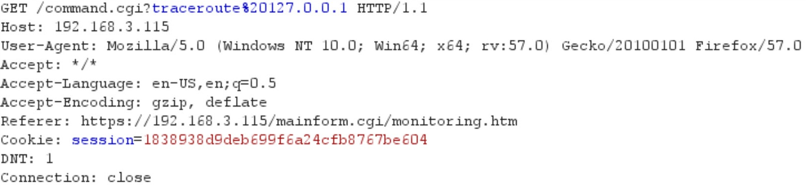
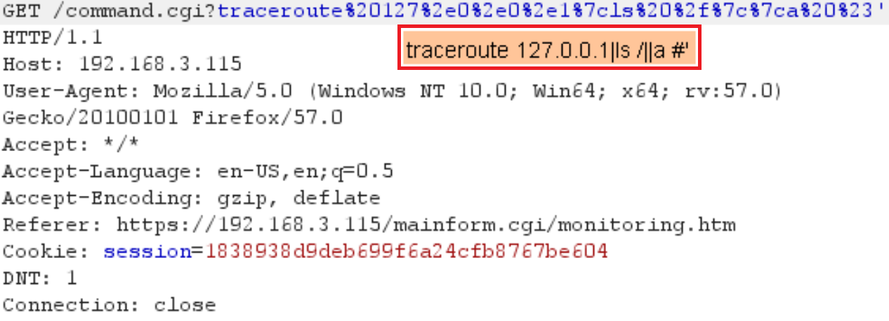
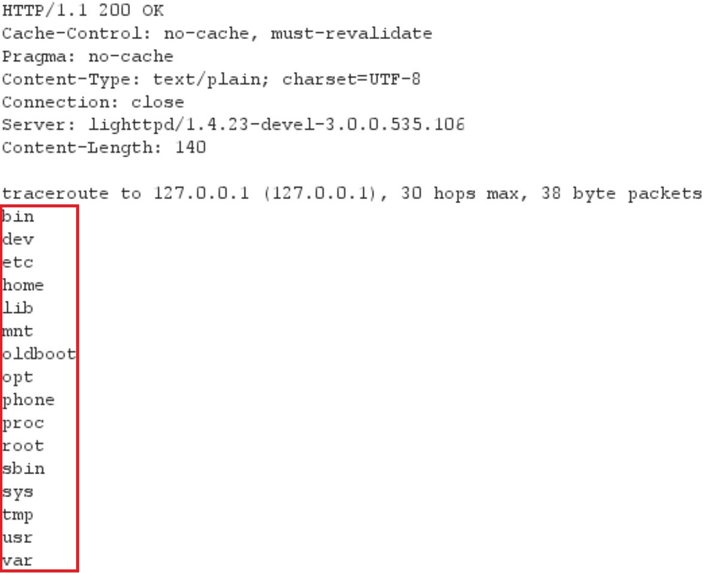

# CVE-2018-5757: RCE In AudioCodes 450HD Phone

## Information
**Description:** Improper input sanitization allows an authenticated user remote code execution on AudioCodes 450HD phones through the "Ping" and "Traceroute" diagnostics functionality.  
**Versions Affected:** AudioCodes 450HD Phone firmware version 3.0.0.535.106 has been tested. Other versions (previous and later) are likely affected as well.  
**Researcher:** Spencer Gietzen of Rhino Security Labs (https://github.com/SpenGietz)  
**Disclosure Link:** N/A (this is it)  
**NIST CVE Link:** https://nvd.nist.gov/vuln/detail/CVE-2018-5757  

## Proof-of-Concept Exploit
### Description
The "Ping" and "Traceroute" functions in the AudioCodes 450HD web UI place user-supplied content into operating system commands without proper sanitization. This allows for the injection of operating system commands as the user running the web server. This web UI also uses a default set of administrator credentials (User is "admin", pass is "1234"), so it is trivial to gain access to the vulnerable functionality.  

### Usage/Exploitation
- First login to the web UI of the device. There is a default administrator user using "admin" as the password and "1234" as the password.  
- When making a request to the "Traceroute" function of the web UI, something similar to the following request is made:  

- By modifying the query string of the URL, it is possible to inject arbitrary commands to run on the operating system. The payload that was confirmed working looked like this:
```
traceroute 127.0.0.1|<YOUR COMMAND>|a #'
```
- Here is an example screenshot that runs "ls /" on the operating system.  

- The following screenshot shows the output of the previous command, which shows that localhost was tracerouted and then a listing of the "/" folder follows.  
