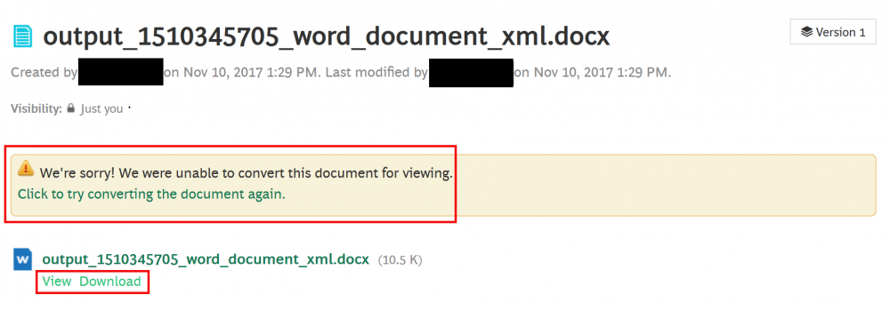

# CVE-2018-5758: XXE in Jive-n

<!---
Remember to end each line under the "Information" header with 2 space characters ("  ") to tell Markdown to break the line.
--->
## Information
**Description:** The Upload File functionality in upload.jspa in Aurea Jive Jive-n 9.0.2.1 On-Premises allows for an XML External Entity attack through a crafted file, allowing attackers to read arbitrary files.  
**Versions Affected:** Jive-n 9.0.2.1 (earlier versions unknown)  
**Researcher:** Spencer Gietzen (https://github.com/SpenGietz) and Dwight Hohnstein (https://github.com/djhohnstein)  
**Disclosure Link:** https://rhinosecuritylabs.com/research/xml-external-entity-injection-xxe-cve-2018-5758/  
**NIST CVE Link:** https://nvd.nist.gov/vuln/detail/CVE-2018-5758  

## Proof-of-Concept Exploit
### Description
Jive-n attempts to render OXML documents, suchs as Word .docx, PowerPoint .pptx, and Excel .xlst files and XML external entities have not been disabled on the server side. Uploading a malicious OXML file allows an attacker to extract files and directory listings from the target server to an out-of-band C2 server. The file will get uploaded and the application will attempt to render it in a Flash object to show the user, but it will fail. At that point, clicking "View" under the failed rendering will execute the payload.  

### Usage/Exploitation
1. Generate a malicious OXML file using something like https://github.com/BuffaloWill/oxml_xxe. In this example, we used a .docx file and are attempting to read /etc/passwd and extract the contents to our out-of-band server over FTP. When executed, the payload should read /etc/passwd and reach out to our server over HTTP, where our server will respond with an XML DTD that instructs the target server to send the contents of /etc/passwd back to our server over FTP.  
2. Using this script: https://github.com/RhinoSecurityLabs/Security-Research/blob/master/tools/python/xxe-server.py, setup an HTTP listener and an FTP listener on your C2 server. In this example we used port 80 for HTTP and 8080 for FTP.  
3. Using the "Upload File" functionality of Jive-n, upload the malicious .docx file from step 1 and then click "Save Draft".  
4. The next page will attempt to render the document, but should display the error "We're sorry! We were unable to convert this document for viewing.". Now, click "View", which is located under that error message (first picture below).  
5. Our payload should execute and the contents of /etc/passwd should arrive at our FTP server (second picture below). The section in the screenshot inside the blue box is the initial HTTP request that was made from our target to our server. The section inside the green box is our HTTP server responding with the DTD. The section inside the orange box is a small portion of the contents contained in /etc/passwd.  

### Screenshot

