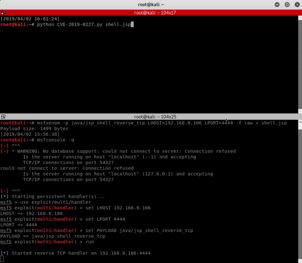

# CVE-2019-0227: Apache Axis 1.4 Remote Code Execution

## Information
**Description:** This allows remote code execution on an Apache Axis 1.4 server if it is on the same network as the attacker.  
**Versions Affected:** 1.4  
**Researcher:** David Yesland (https://twitter.com/daveysec @daveysec)  
**Disclosure Link:** https://rhinosecuritylabs.com/application-security/cve-2019-0227-expired-domain-rce-apache-axis/  
**NIST CVE Link:** https://nvd.nist.gov/vuln/detail/CVE-2019-0227  

## Proof-of-Concept Exploit
### Description
The default service StockQuoteService.jws that comes with Axis contains a hard coded HTTP URL which can be used to trigger an HTTP request. This exploit performs a MITM attack using ARP poisoning against the server and redirects the HTTP request to a malicious web server which performs a redirect to the localhost of the Axis server and uses this to launch a malicious service which is then used to write and execute a JSP file on the server.

### Usage/Exploitation
The exploit uses ARP poisoning to redirect an HTTP requests from the server so you need to be on the same network as the server. Using CVE-2019-0227.py fill in the necessary variables. Run `python CVE-2019-AXIS.py payload.jsp` where `payload.jsp` is whatever payload you want to write and execute on the server.  
Python version: Python 2  

### Screenshot

