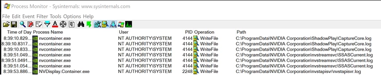

# CVE‑2019‑5674: NVIDIA GeForce Experience Arbitrary File Overwrites

## Information
**Description:** This allows arbitrary system files to be overwritten as a  low privileged user.  
**Versions Affected:** < 3.18  
**Researcher:** David Yesland (https://twitter.com/daveysec @daveysec)  
**Disclosure Link:** https://rhinosecuritylabs.com/application-security/nvidia-arbitrary-file-writes-to-command-execution-cve-2019-5674/  
**CVE Link:** https://nvidia.custhelp.com/app/answers/detail/a_id/4784  

## Proof-of-Concept Exploit
### Description
NVIDIA Experience sets unsafe permissions on multiple log files when it is installed. Because of this it is possible for a low privileged user to create a symlink from these log files to any other system file and overwrite the contents of the system file due to the fact GFE writes to the logs with SYSTEM permissions. It was also found that it is possible to pollute some of these files with commands and write a file to the system startup folder leading to commands being executed by other users at startup.  

### Usage/Exploitation
This requires the script to be ran in 2 steps. Boot into safe-mode run `python nvidia_exploit.py 1` and then reboot and run `python nvidia_exploit.py 2`. This is also possible to avoid booting into safe-mode if a DoS against the NVIDIA service is used or the user has privileges to start and stop the NVIDIA services. This PoC requires createsymlink.exe from https://github.com/googleprojectzero/symboliclink-testing-tools.  
Python version: Python 2  

### Screenshot

