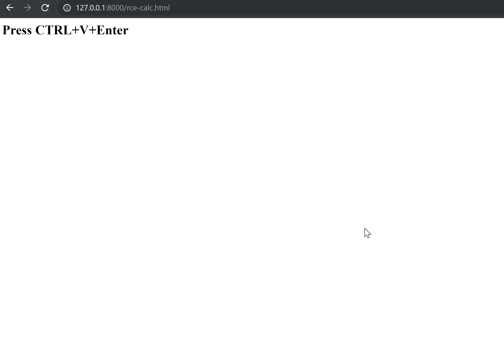

# CVE‑2019‑5678: Command Injection in Nvidia GeForce Experience Web Helper

## Information
**Description:** This vulnerability allows execution of arbitrary commands on a system with the NVIDIA GeForce Experience (GFE) prior to version 3.19 installed. This can be achieved by convincing a victim to visit a crafted web site and make a few key presses. This is possible due to command injection which was discovered in a local NodeJS server which GFE launches on startup.  
**Versions Affected:** < 3.19  
**Researcher:** David Yesland (https://twitter.com/daveysec @daveysec)  
**Disclosure Link:** https://rhinosecuritylabs.com/application-security/nvidia-rce-cve-2019-5678  
**NIST CVE Link:** https://nvd.nist.gov/vuln/detail/CVE‑2019‑5678  
**Vendor Disclsure:** https://nvidia.custhelp.com/app/answers/detail/a_id/4806  

## Proof-of-Concept Exploit
### Description
By convincing a user into pressing CTRL+V+Enter it is possible to force an upload of a configuration file containing a secret needed to make a cross origin request to a local Node server which contains a command injection vulnerability and execute arbitrary commands.  

### Usage/Exploitation
Visit the proof of concept HTML page in Chrome and press the keys to trigger it.  

### Screenshot

