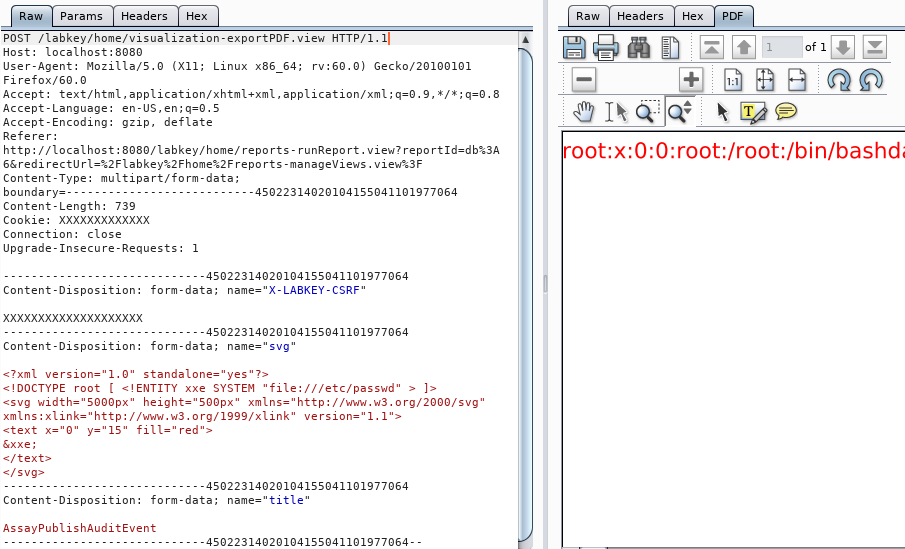

# CVE-2019-9757: LabKey Server XXE

## Information
**Description:** An XXE vulnerability exists in LabKey Server due to an outdated Java library. This allows arbitrary files to be read from the server.  
**Versions Affected:** LabKey Server 19.1.0  
**Researcher:** David Yesland (https://twitter.com/daveysec)  
**Disclosure Link:** https://rhinosecuritylabs.com/application-security/labkey-server-vulnerabilities-to-rce  
**NIST CVE Link:** https://nvd.nist.gov/vuln/detail/CVE-2019-9757  

## Proof-of-Concept Exploit
### Description
The application parses SVG/XML data to render as an image if an external entity is used in the XML it is possible to render the contents of files into the image.  

### Usage/Exploitation
Within LabKey Server, export a report graph as a PNG and send the contents of CVE-2019-9757.svg with the POST request.  

### Screenshot

