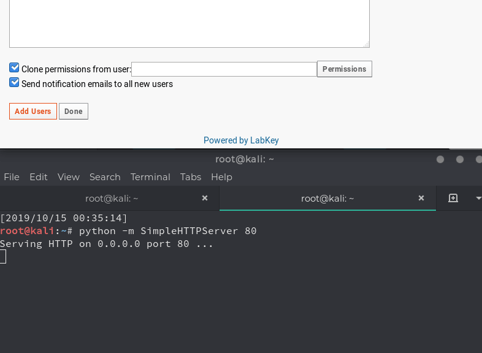

# CVE-2019-9926: LabKey Server CSRF

## Information
**Description:** This allows a CSRF attack to be performed against an admin of LabKey Server to an endpoint which can run R script and leads to RCE.  
**Versions Affected:** LabKey Server 19.1.0  
**Researcher:** David Yesland (https://twitter.com/daveysec)  
**Disclosure Link:** https://rhinosecuritylabs.com/application-security/labkey-server-vulnerabilities-to-rce  
**NIST CVE Link:** https://nvd.nist.gov/vuln/detail/CVE-2019-9926  

## Proof-of-Concept Exploit
### Description
The application has functionality to process data using user defined scripts. This endpoint was found to be vulnerable to CSRF by changing a POST request to a GET. This allows an arbitrary script to be defined and executed if an authenticated admin visits the crafted URL.  

### Usage/Exploitation
As an authenticated admin visit `http://localhost:8080/labkey/reports-viewScriptReport.view?reportType=ReportService.rreport&script=system("ls")`.   

### Screenshot
