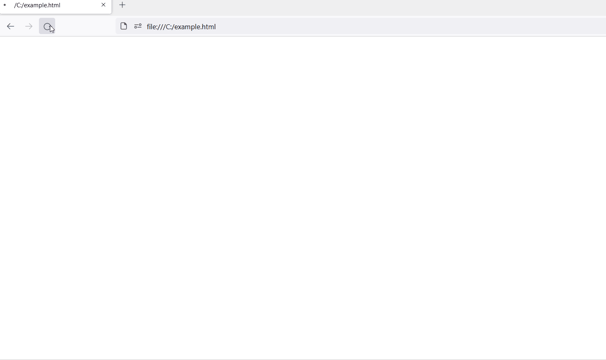

# CVE-2021-38112: AWS WorkSpaces Remote Code Execution

## Information
**Description:** This vulnerability allows arbitrary commands to be executed when opening a crafted URI in Amazon AWS WorkSpaces client.  
**Versions Affected:** < 3.1.9  
**Researcher:** David Yesland @daveysec (https://twitter.com/daveysec)  
**Disclosure Link:** https://rhinosecuritylabs.com/aws/cve-2021-38112-aws-workspaces-rce/  
**NIST CVE Link:** https://nvd.nist.gov/vuln/detail/CVE-2021-38112  

## Proof-of-Concept Exploit
### Description
When a user opens the HTML page with the attackers valid WorkSpace registration code, they are redirected to the crafted URI which will launch calc.exe upon the WorkSpaces client opening.  

### Usage/Exploitation
Create a valid WorkSpaces registration code in AWS AD and open the HTML file. Enter to code and click the button.  

### Screenshot

