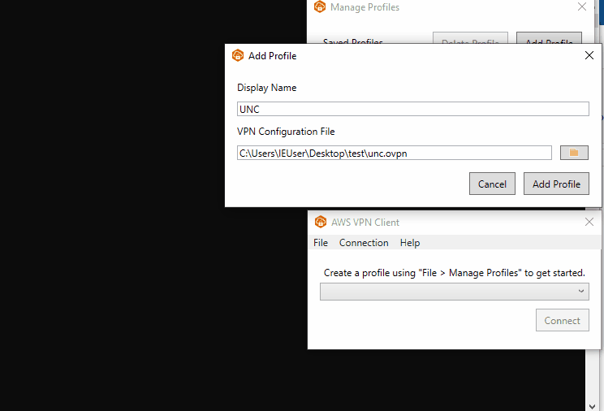

# CVE-2022-25165: AWS VPN Client Information Disclosure Via UNC Path

## Information
**Description:** This allows information leakage of a user’s Net-NTLMv2 hash when importing a VPN configuration file.  
**Versions Affected:** 2.0.0
**Version Fixed:** 3.0.0    
**Researcher:** David Yesland (https://twitter.com/daveysec)  
**Disclosure Link:** https://rhinosecuritylabs.com/aws/cve-2022-25165-aws-vpn-client/  
**NIST CVE Link:** https://nvd.nist.gov/vuln/detail/CVE-2022-25165  

## Proof-of-Concept Exploit
### Description
It is possible to include a UNC path in the OpenVPN configuration file when referencing file paths for directives (such as “auth-user-pass”). When this file is imported to the AWS VPN Client and the client attempts to validate the file path it performs an open operation on the path and leaks the user’s Net-NTLMv2 hash to an external server.

The impact is information leakage of a user’s Net-NTLMv2 hash. This could be exploited by having a user attempt to import a malicious VPN configuration file into the AWS VPN Client.  

### Usage/Exploitation
Run Responder.  
Replace your server with the one in `CVE-2022-25165.ovpn`.  
Attempt to import `CVE-2022-25165.ovpn` into AWS VPN Client.  

### Screenshot

