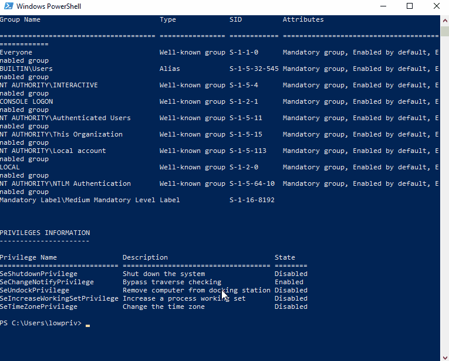

# CVE-2022-25166: AWS VPN Client Arbitrary File Write as SYSTEM

## Information
**Description:** This allows an arbitrary file write as SYSTEM with partial control of the written contents.  
**Versions Affected:** 2.0.0  
**Researcher:** David Yesland (https://twitter.com/daveysec)  
**Disclosure Link:** https://rhinosecuritylabs.com/aws/cve-2022-25165-aws-vpn-client/  
**NIST CVE Link:** https://nvd.nist.gov/vuln/detail/CVE-2022-25166  

## Proof-of-Concept Exploit
### Description
A race condition exists during the validation of OpenVPN configuration files. This allows OpenVPN configuration directives outside of the AWS VPN Client allowed OpenVPN directives list to be injected into the configuration file prior to the AWS VPN Client service, which runs as SYSTEM, processing the file. Dangerous arguments can be injected by a low level user such as “log” which allows an arbitrary destination to be specified for writing log files.

The impact is an arbitrary file write as SYSTEM with partial control over the contents of the file. This can lead to local privilege escalation or denial of service. 

### Usage/Exploitation
Import file_write.ovpn into AWS VPN Client.  
Execute `CVE-2022-25166.ps1`.  
Click Connect on the AWS VPN Client.  
Wait for the file to be written to C:\poc.txt  

### Screenshot

