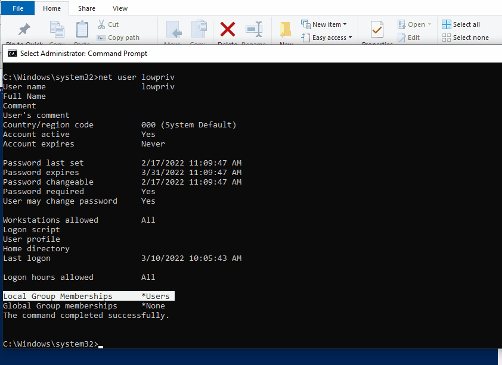

# CVE-2022-25372: Local Privilege Escalation In Pritunl VPN Client

## Information
**Description:** This allows privilege escalation on Windows with Pritunl VPN Client installed.  
**Versions Affected:** < 1.2.3019.52  
**Version Fixed:** 1.2.3019.52a  
**Researcher:** David Yesland (https://twitter.com/daveysec)  
**Disclosure Link:** https://rhinosecuritylabs.com/blog/  
**NIST CVE Link:** https://nvd.nist.gov/vuln/detail/CVE-2022-25372  

## Proof-of-Concept Exploit
### Description
The Pritunl VPN Client service is vulnerable to an arbitrary file write as SYSTEM on Windows. This is due to insecure directory permissions on the Pritunl ProgramData folder. The arbitrary file write is then able to be leveraged for full privilege escalation due to the privileged Pritunl VPN service executing commands as SYSTEM without specifying the full path of the executable.  

### Usage/Exploitation
After importing a profile named “privesc”, run CVE-2022-25372.ps1 and click “connect” repeatedly on the "privesc" VPN profile while the loop runs.  

### Screenshot

