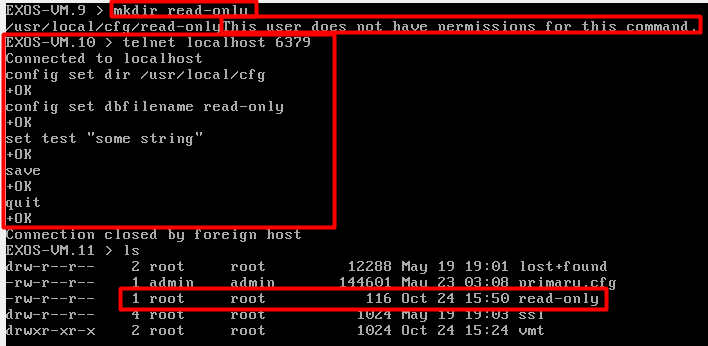

# CVE-2023-43119: Extreme Networks EXOS Arbitrary File Write as Root

## Information
**Description:** It is possible to use telnet to gain privilege escalation via the Redis server to perform arbitrary filesystem operations with root privilege.  
**Versions Affected:** 32.1.1.6  
**Version Fixed:** See the vendors advisory  
**Researcher:** David Yesland (https://twitter.com/daveysec)  
**Disclosure Link:** https://rhinosecuritylabs.com/research/extreme-networks-extremexos-vulnerabilities  
**Advisory:** https://extreme-networks.my.site.com/ExtrArticleDetail?an=000114378  

## Proof-of-Concept Exploit
### Description
A local Redis server runs on the device with no authentication enabled. This can be abused via telnet by a low privileged user to write files as root.  

### Usage/Exploitation
Log into the device as a low privileged user and execute the commands in CVE-2023-43119.sh.  

### Screenshot

