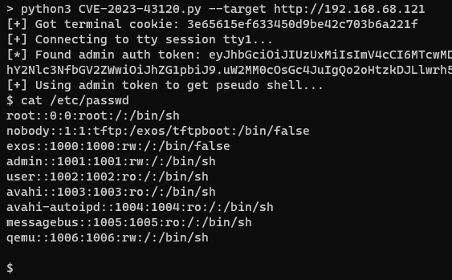

# CVE-2023-43120: Extreme Networks EXOS Privilege Escalation from read-only User to Admin

## Information
**Description:** It is possible to escalate permissions from a user with “read-only” permissions to an administrator “read-write” permissions by using the telnet tool may be used to forge an HTTP request to obtain administrator privilege.  
**Versions Affected:** 32.1.1.6  
**Version Fixed:** See the vendors advisory  
**Researcher:** David Yesland (https://twitter.com/daveysec)  
**Disclosure Link:** https://rhinosecuritylabs.com/research/extreme-networks-extremexos-vulnerabilities  
**Advisory:** https://extreme-networks.my.site.com/ExtrArticleDetail?an=000114377  

## Proof-of-Concept Exploit
### Description
This abuses the telnet utility on the device to forge an HTTP request to a locally running privileged API and execute commands as root.  

### Usage/Exploitation
```
usage: CVE-2023-43120.py [-h] --target TARGET [--user USER] [--password PASSWORD]

User to admin escalation

optional arguments:
  -h, --help           show this help message and exit
  --target TARGET      Target (http://<ip>)
  --user USER          Username if different from "user"
  --password PASSWORD  Password if different from empty
```

### Screenshot

