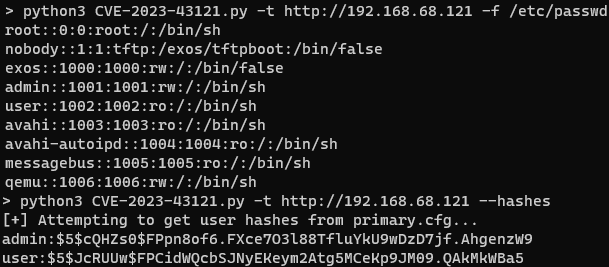

# CVE-2023-43121: Extreme Networks EXOS Unauthenticated File Read

## Information
**Description:** A directory traversal vulnerability in the Chalet application in EXOS allows any file on the system to be read.  
**Versions Affected:** 32.1.1.6  
**Version Fixed:** See the vendors advisory  
**Researcher:** David Yesland (https://twitter.com/daveysec)  
**Disclosure Link:** https://rhinosecuritylabs.com/research/extreme-networks-extremexos-vulnerabilities  
**Advisory:** https://extreme-networks.my.site.com/ExtrArticleDetail?an=000114376  

## Proof-of-Concept Exploit
### Description
Explain why/how the exploit works.  

### Usage/Exploitation
```
usage: CVE-2023-43121.py [-h] [-f FILE] -t TARGET [-o OUTPUT] [--hashes]

optional arguments:
  -h, --help            show this help message and exit
  -f FILE, --file FILE  File to read
  -t TARGET, --target TARGET
                        EXOS Target (http://<ip>)
  -o OUTPUT, --output OUTPUT
                        Output file to write contents to
  --hashes              Just get the user hashes from the device
```  

### Screenshot

