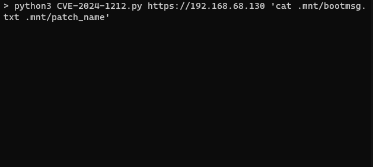

# CVE-2024-1212: Unauthenticated Command Injection in Progress Kemp LoadMaster

## Information
**Description:** This allows unauthenticated command injection in the Progress Kemp LoadMaster via the admin web service.  
**Versions Affected:** All LoadMaster releases after 7.2.48.1  
**Version Fixed:** 7.2.59.2 (GA), 7.2.54.8 (LTSF), 7.2.48.10 (LTS)  
**Researcher:** Dave Yesland  
**Disclosure Link:** git@github.com:RhinoSecurityLabs/CVEs.git  
**NIST CVE Link:** https://nvd.nist.gov/vuln/detail/CVE-2024-1212  
**Vendor Advisory:** https://support.kemptechnologies.com/hc/en-us/articles/23878931058445-LoadMaster-Security-Vulnerability-CVE-2024-1212  

## Proof-of-Concept Exploit
### Description
The exploit bypasses API restrictions and executes commands through a command injection in the basic authorization header.  

### Usage/Exploitation
`python3 CVE-2024-1212.py https://LM_host 'ls'` 

### Screenshot

