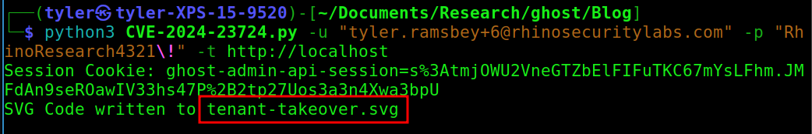
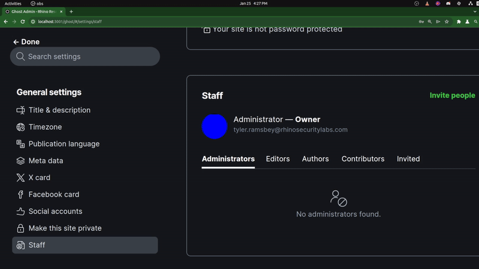

# CVE-2024-23724: Ghost CMS Stored XSS Leading to Owner Takeover

## Information
**Description:** Ghost CMS through 5.76.0 allows Stored XSS, and resultant privilege escalation in which a contributor can take ownership of the tenant, via an SVG profile picture that contains JavaScript code to interact with the API on TCP Port 3001.   
**Versions Affected:** Confirmed on 5.76.0 but affects all versions   
**Version Fixed:** [Pull Request #19646](https://github.com/TryGhost/Ghost/pull/19646) (Open)   
**Researcher:** Tyler Ramsbey (https://youtube.com/@TylerRamsbey)  
**Disclosure Link:** https://rhinosecuritylabs.com/blog/  
**NIST CVE Link:** https://nvd.nist.gov/vuln/detail/CVE-2024-23724

## Proof-of-Concept Exploit
### Description
Ghost CMS is affected by Stored Cross-Site Scripting in users' profile pictures. An authenticated attacker with the lowest privileged role (contributor) can exploit this to become the Owner of the Ghost CMS instance, leading to full tenant and account takeover.

### Usage/Exploitation
`Usage: python3 CVE-2024-23724 -u <username> -p <password> -t <target_url>`  

 

This will output the malicious SVG file to upload as a profile picture. When this picture is viewed by the "Owner" of the tenant, it will transfer ownership to the attacker. 

 

## Unofficial Patch
### Description
The vendor does not view this as a valid vector so will not be releasing an official patch, but it’s important to us at Rhino to not release unpatched vulnerabilities. While this is a unique case, we’ve decided to make the patch ourselves which is available at https://github.com/TryGhost/Ghost/pull/19646. 
