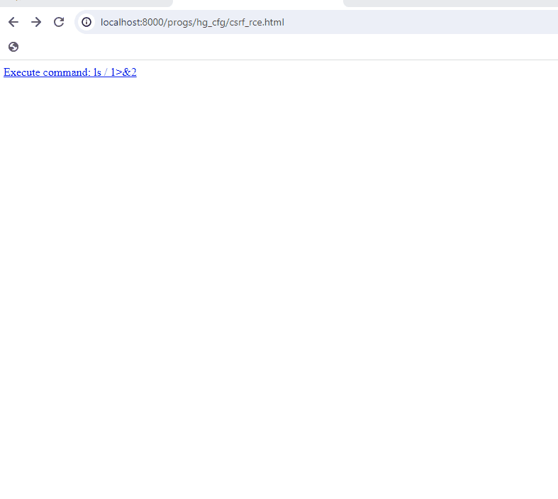

# CVE-2024-2449: Cross-Site Requets Forgery in Progress Kemp LoadMaster

## Information
**Description:** This demonstrates a bypass in the CSRF protections of the Progress Kemp LoadMaster WUI.  
**Versions Affected:**  7.2.59.2 
**Version Fixed:** See vendor advisory.  
**Researcher:** Dave Yesland (https://twitter.com/daveysec)  
**Disclosure Link:** https://rhinosecuritylabs.com/research/cve-2024-2448-kemp-loadmaster/  
**NIST CVE Link:** https://nvd.nist.gov/vuln/detail/CVE-2024-2449
**Vendor Disclosure** https://support.kemptechnologies.com/hc/en-us/articles/25119767150477-LoadMaster-Security-Vulnerabilities-CVE-2024-2448-and-CVE-2024-2449  

## Proof-of-Concept Exploit
### Description
This bypasses CSRF protections by serving the HTML file from the same directory as the targeted WUI page and including the referer. This bypasses the regex checks of the Referer header. 

### Usage/Exploitation
Serve the HTML file from the `/progs/hg_cfg` directory.  

### Screenshot
