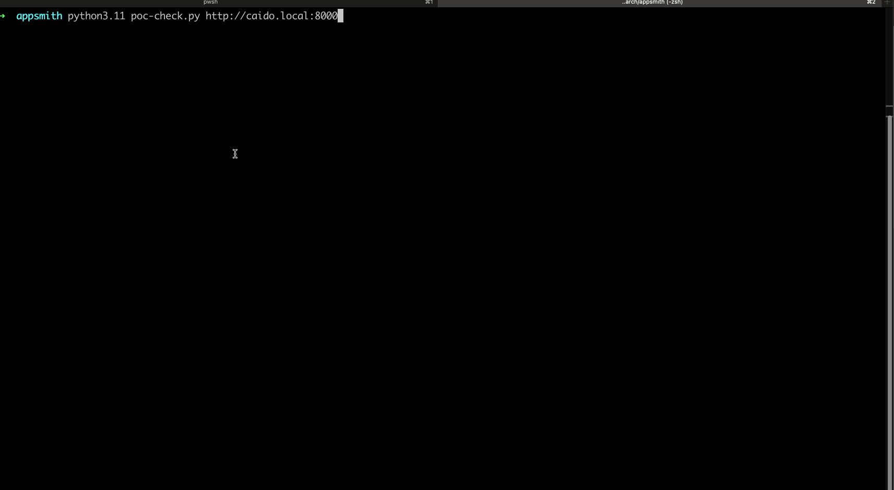

# CVE-2024-55963: Unauthenticated Remote Code Execution as postgres user

## Information
**Description:** A Remote Code Execution (RCE) vulnerability in Appsmith.
**Versions Affected:** v1.20-v1.51 
**Version Fixed:** v1.52 
**Researcher:** Whit Taylor (https://x.com/un1tycyb3r)  
**Disclosure Link:** A BLOG LINK HERE  
**NIST CVE Link:** https://nvd.nist.gov/vuln/detail/CVE-2024-55963  

## Proof-of-Concept Exploit
### Description
A RCE vulnerability in Appsmith, application development platform. 

### Usage/Exploitation
```
python3 appsmith-rce.py -u <target> -p <port>
```

### Demo
