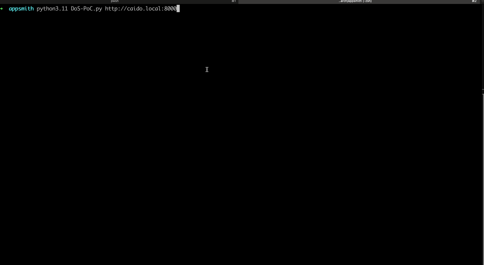

# CVE-2024-55965: Denial of Service via Broken Access Control allowing “App Viewer” access to ‘Restart’ API request

## Information
**Description:** Broken Access Control Vulnerability in Appsmith.  
**Versions Affected:** v1.20-v1.51  
**Version Fixed:** v1.48  
**Researcher:** Whit Taylor (https://x.com/un1tycyb3r)  
**Disclosure Link:** [https://rhinosecuritylabs.com/research/cve-2024-55963-unauthenticated-rce-in-appsmith](https://rhinosecuritylabs.com/research/cve-2024-55963-unauthenticated-rce-in-appsmith)  
**NIST CVE Link:** https://nvd.nist.gov/vuln/detail/CVE-2024-55965  

## Proof-of-Concept Exploit
### Description
A broken access control vulnerability leading to denial of service in appsmith, a application development platform.  

### Usage/Exploitation
```python3 CVE-2024-55965.py <base_url>```  

### Demo

