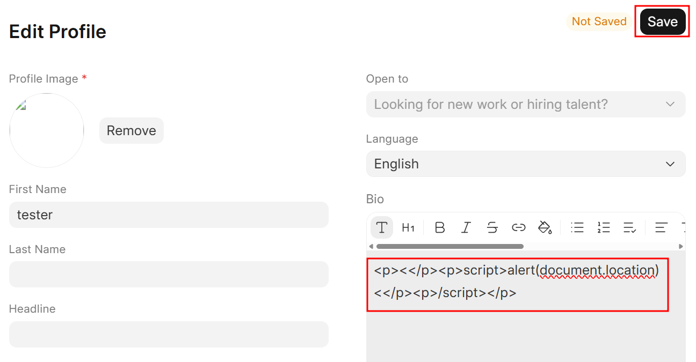
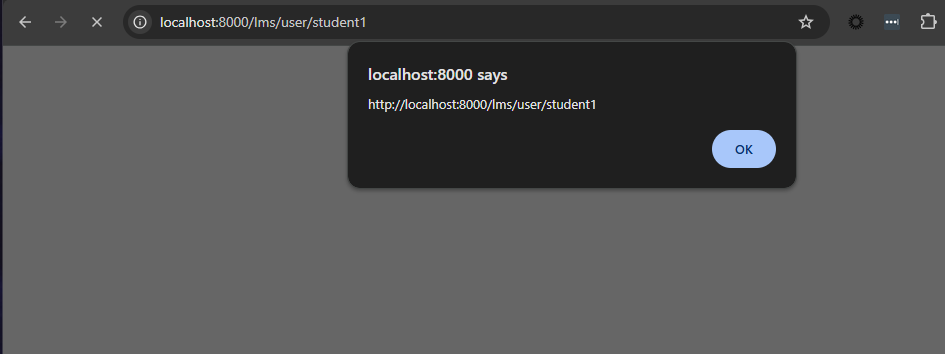

# CVE-2026-34606: Frappe LMS Stored XSS in Profile Bio and Other Fields

<!---
Remember to end each line under the "Information" header with 2 space characters ("  ") to tell Markdown to break the line.
--->
## Information
**Description:** This exploits BeautifulSoup's `get_text()` being used on sanitized HTML to reassemble a `<script>` tag from separate text nodes, bypassing sanitization and achieving stored XSS.  
**Versions Affected:** >= 2.27.0, < 2.48.0  
**Version Fixed:** 2.48.0  
**Researcher:** Nick Hefty  
**Disclosure Link:** [Rhino Security Labs Blogpost](https://rhinosecuritylabs.com/research/multiple-vulnerabilities-in-frappe-lms-leading-to-remote-code-execution)    
**NIST CVE Link:** https://nvd.nist.gov/vuln/detail/CVE-2026-34606  

## Proof-of-Concept Exploit
### Description
Frappe LMS correctly applies HTML sanitization to rich-text fields on submission. The profile bio field, for example, intentionally permits a subset of HTML tags such as `<p>`, ``, and `<a>`, while dangerous elements like `<script>` are stripped by the sanitizer before the content is stored. This works as intended.

The bypass occurs when generating a preview of stored content. The application passes the sanitized HTML through BeautifulSoup's `get_text()` method to extract a plain-text representation. `get_text()` is a text extraction function, not a sanitization function: it walks the HTML parse tree and concatenates every text node it encounters, without inspecting whether the assembled output contains dangerous sequences and without encoding or escaping the result.

This creates a second-order attack surface. An attacker can craft input that contains no dangerous tags, but whose text nodes, when concatenated by `get_text()`, assemble into a valid executable payload. The assembled output is then rendered in the preview context without a second sanitization pass.

Given the payload below, `get_text()` extracts the text node from each `<p>` tag — `<`, then `script>alert(document.location)<`, then `/script>` — and concatenates them into a working `<script>` tag. This can be demonstrated directly in a Python interpreter:

```
>>> from bs4 import BeautifulSoup
>>> soup = BeautifulSoup("<p><</p><p>script>alert(document.location)<</p><p>/script></p>")
>>> soup.get_text()
'<script>alert(document.location)</script>'
```

The profile bio field is the most impactful surface for this vulnerability because any registered student can edit their own bio, and every user who views the attacker's profile page is affected.

### Usage/Exploitation
Log into an account, navigate to the user profile, click **Edit Profile**, and enter the following payload into the **Bio** field before clicking **Save**:

```
<p><</p><p>script>alert(document.location)<</p><p>/script></p>
```

Refresh the profile page and the payload executes.

### Additional Vector: Lesson Content
The lesson content editor performs sanitization client-side only, and it is not enforced server-side. An attacker can navigate to a course, click **Edit** and then **Add Lesson**, enter any title and content, and intercept the outbound `POST` to `/api/method/frappe.client.insert` with a proxy such as Burp Suite. Appending `` to the `content` field inside the `doc` object and forwarding the request stores the payload directly, and it executes when the lesson page is loaded.

### Screenshots



